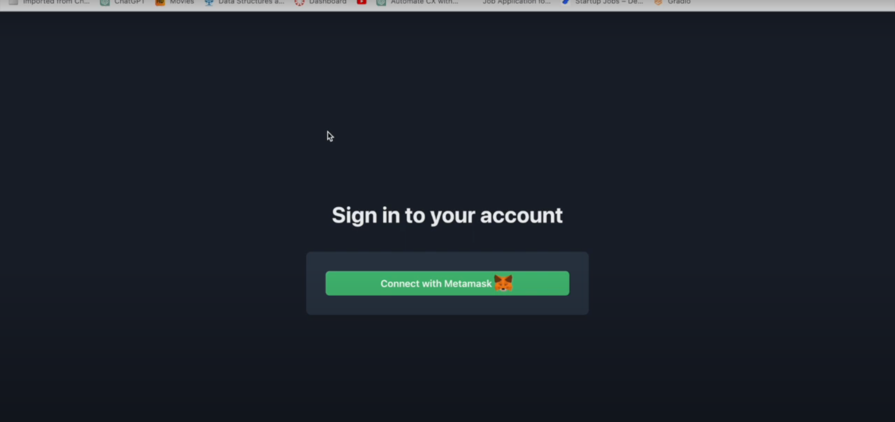
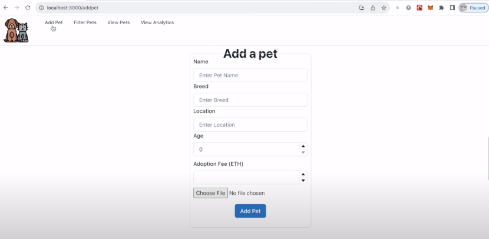
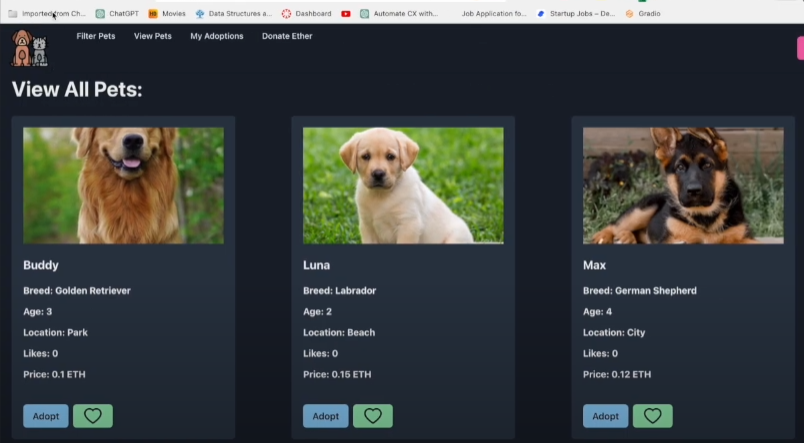
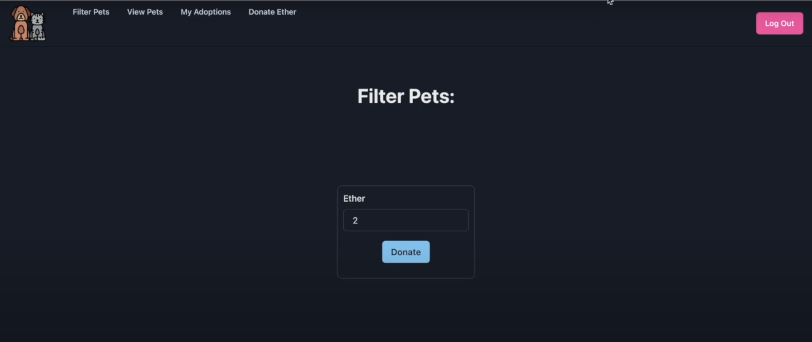
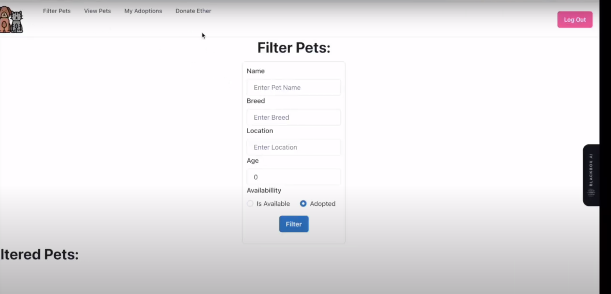
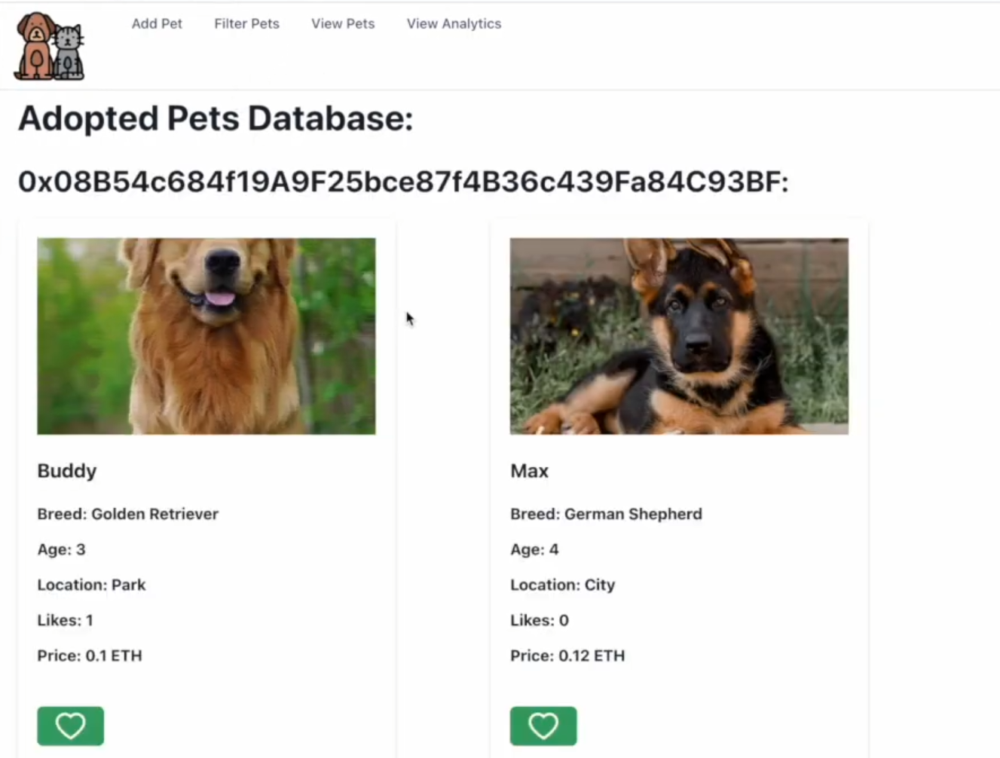

# Pet Shop Truffle Box 
---

## Decentralized Application (DApp) using Truffle, Ganache, Metamask, and npm

Welcome to the README for our Decentralized Application (DApp) built using Truffle, Ganache, Metamask, and npm. This document provides a quick overview of the project and instructions to get started.

## Table of Contents

- [Introduction](#introduction)
- [Prerequisites](#prerequisites)
- [Version](#version)
- [Installation](#installation)
- [Usage](#usage)
- [Features](#features)
- [Video](#video)
- [Team](#team)

## Introduction

Our DApp is a decentralized application built on the Ethereum blockchain using the following technologies:

- [Truffle](https://www.trufflesuite.com/truffle): A development framework for Ethereum.
- [Ganache](https://www.trufflesuite.com/ganache): A personal blockchain for Ethereum development.
- [Metamask](https://metamask.io/): A browser extension for interacting with Ethereum dApps.
- [npm](https://www.npmjs.com/): A package manager for JavaScript.

The DApp showcases [describe what your DApp does briefly].

## Prerequisites

Before you begin, make sure you have the following software installed:

- Node.js and npm: [Download and install Node.js](https://nodejs.org/).
- Truffle: Install Truffle globally using npm:
  ```
  npm install -g truffle
  ```
- Ganache: Download and install Ganache from the [official website](https://www.trufflesuite.com/ganache).
- Metamask: Install the Metamask extension in your browser from the [Metamask website](https://metamask.io/).

## Version

Node.js version: v20.3.0
lite-server version: ^2.3.0
Solidity version: ^0.8.19
web3 version: ^4.0.3
Truffle version: v5.11.1 (core: 5.11.1)
Ganache version or ganache-cli version: v7.9.0
Front End Framework: React

 > Rest of the versions
    @emotion/react: 11.11.1
    @emotion/styled: 11.11.0
    @mui/material: 5.14.4
    @testing-library/jest-dom: 5.17.0
    @testing-library/react: 13.4.0
    @testing-library/user-event: 13.5.0
    aws-sdk: 2.1435.0
    bootstrap: 5.3.1
    react: 18.2.0
    react-dom: 18.2.0
    react-router-dom: 6.15.0
    react-scripts: 5.0.1
    web-vitals: 2.1.4
    web3: 4.0.3
    @babel/plugin-proposal-private-property-in-object: 7.21.11

## Installation

Follow these steps to set up and run the DApp locally:

1. Clone this repository:
   ```
   git clone https://github.com/your-username/your-dapp.git
   ```

2. Navigate to the project folder:
   ```
   cd frontend
   ```

3. Install project dependencies:
   ```
   npm install
   ```

## Usage

1. Start Ganache and create a new workspace.

2. Import one of the Ganache accounts into Metamask.

3. Configure Metamask to connect to your Ganache network.

4. Compile and migrate the smart contracts:
   ```
   truffle compile
   truffle migrate
   ```

5. Start the development server:
   ```
   npm run start
   ```

6. Access the DApp in your browser through the provided URL.


## Features

Sign in 
---
Add a Pet 
---
View all Pet (Including Adopt and Like) 
---
Donate Ether 
---
Filter Adopted and Available Pets 
---
Ownership Tracking 


## Video

Video Link: https://youtu.be/FlABKUNQHY8

## Team

Vikram Narra 

Yashank Bhola

Yuxuan Gao


Thank you for using our DApp! If you have any questions or need assistance, please [contact us](mailto:yashank.bhola@mail.utoronto.ca).